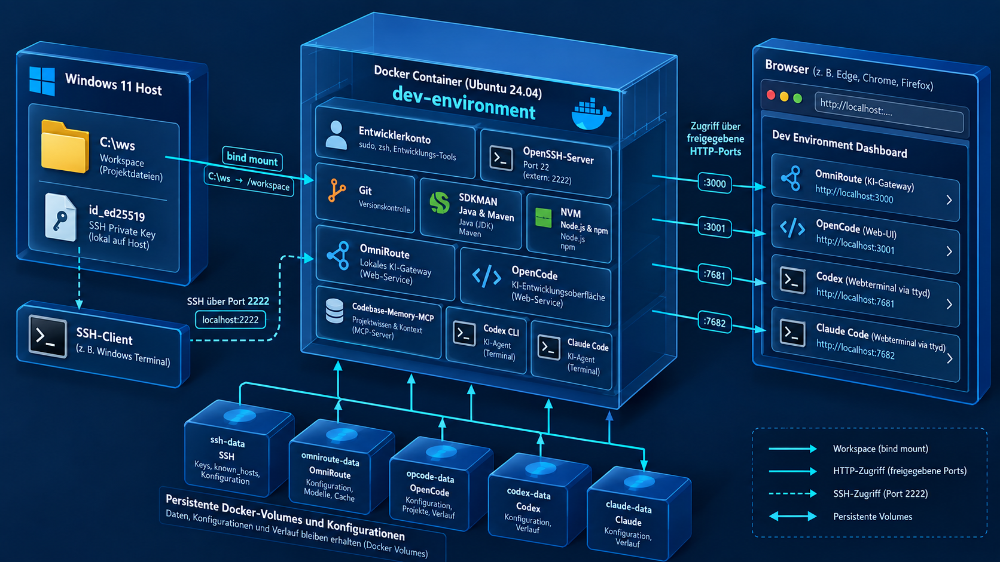

# Docker-Entwicklungsumgebung

Dieses Projekt stellt eine einheitliche Entwicklungsumgebung auf Basis von Docker bereit.  
Unter Windows kann sie z. B. mit Rancher Desktop und der Container Engine **Moby** verwendet werden.

Die Umgebung enthält unter anderem:

- Ubuntu 24.04
- SDKMAN!
- Git
- OpenSSH Client und Server
- `sudo`
- ttyd
- btop
- Midnight Commander (`mc`)
- NVM
- Node.js
- npm
- omniroute
- opencode-ai
- codebase-memory-mcp
- Codex CLI
- Claude Code (native installation)

Beim Image-Build wird npm nach der Node.js-Installation automatisch auf die aktuelle Version aktualisiert.

Die Versionen von Java, Node.js und NVM können über die `.env`-Datei konfiguriert werden. Java und Maven werden mit SDKMAN! verwaltet.

## Verzeichnisstruktur

Vorgesehen ist eine Struktur, bei der alle Entwicklungsprojekte unter einem gemeinsamen Verzeichnis liegen und dieses Docker-Projekt parallel dazu ausgecheckt wird.

Beispiel:

```text
C:\ws
├── DocGen
├── Projekt-A
├── Projekt-B
└── docker-dev
    ├── Dockerfile
    ├── compose.yaml
    ├── entrypoint.sh
    ├── .env
    └── README.md
```

Das gemeinsame Verzeichnis `C:\ws` wird in den Container eingebunden und steht dort unter `/workspace` zur Verfügung.

Beispiel:

```text
C:\ws\DocGen
```

wird im Container zu:

```text
/workspace/DocGen
```

## Voraussetzungen

Unter Windows wird eine Docker-kompatible Container-Engine benötigt.

Getestetes Setup:

- Windows 11
- Rancher Desktop
- Moby als Container Engine
- Docker Compose v2

Prüfen:

```powershell
docker version
docker compose version
```

## Konfiguration

Die lokale Konfiguration erfolgt über `.env`.

Beispiel:

```env
NVM_VERSION=v0.40.3
NODE_VERSION=24
JAVA_VERSION=21.0.12+1-sapmchn
MAVEN_VERSION=3.9.16

SSH_PORT=2222
```


### NVM

`NVM_VERSION` legt fest, welche Version von NVM installiert wird.

Beispiel:

```env
NVM_VERSION=v0.40.3
```

### Node.js

`NODE_VERSION` legt die gewünschte Node.js-Hauptversion fest.

Beispiel:

```env
NODE_VERSION=24
```

NVM installiert daraus automatisch die passende aktuelle Version der angegebenen Hauptversion und setzt sie als Standard.

### Java

Standardmäßig installiert und aktiviert das Image SAPMachine 21 über SDKMAN!. `JAVA_VERSION` legt die zu installierende SDKMAN!-Java-Kennung fest.

```env
JAVA_VERSION=21.0.12+1-sapmchn
```

Die verfügbaren Java-Distributionen und Versionen zeigt:

```bash
sdk list java
```

Beispiel für die Installation und Auswahl einer Java-Version:

```bash
sdk install java 21.0.8-tem
sdk default java 21.0.8-tem
```

Für ein einzelnes Projekt kann eine Java-Version über eine `.sdkmanrc` festgelegt werden:

```bash
cd /workspace/Mein-Projekt
sdk env init
# Die erzeugte .sdkmanrc bearbeiten, z. B.: java=21.0.8-tem
sdk env
```

### Maven

Standardmäßig installiert und aktiviert das Image Maven über SDKMAN!. `MAVEN_VERSION` legt die zu installierende SDKMAN!-Maven-Version fest.

```env
MAVEN_VERSION=3.9.16
```

Weitere Maven-Versionen sind mit `sdk list maven` verfügbar.

### SSH-Port

Standardmäßig kann der Container über Port `2222` per SSH erreichbar gemacht werden:

```env
SSH_PORT=2222
```

## SSH-Schlüssel für den Zugang zum Container

Beim ersten Start erzeugt der Container das Zugangsschlüsselpaar automatisch im SSH-Verzeichnis des Windows-Benutzers:

```text
C:\Users\<BENUTZER>\.ssh\docker-dev
C:\Users\<BENUTZER>\.ssh\docker-dev.pub
```

Der private Schlüssel verbleibt ausschließlich auf dem Host.

Die private Schlüsseldatei sollte nicht weitergegeben oder eingecheckt werden.

`rebuild.cmd` und `rebuild-force.cmd` legen `%USERPROFILE%\.ssh` sowie eine leere Datei für den privaten Schlüssel bei Bedarf an. Beim ersten Containerstart wird das SSH-Schlüsselpaar darin erzeugt. Die neue Konfiguration enthält den Alias `d`:

```sshconfig
Host d
    HostName 127.0.0.1
    Port 2222
    User developer
    IdentityFile ~/.ssh/docker-dev
    IdentitiesOnly yes
```

Danach genügt:

```powershell
ssh d
```

Der Container bindet nur die private Schlüsseldatei `docker-dev` schreibbar ein, nicht das gesamte Verzeichnis `%USERPROFILE%\.ssh`. Der private Schlüssel verbleibt auf dem Host; der öffentliche Schlüssel wird im Container daraus abgeleitet.

## Azure-DevOps-SSH-Schlüssel

Beim ersten Start erzeugt der Container einen eigenen RSA-Schlüssel für Azure DevOps:

```text
~/.ssh/azure
~/.ssh/azure.pub
```

Der Schlüssel wird mit RSA und 4096 Bit erzeugt.

Die SSH-Konfiguration im Container enthält:

```sshconfig
Host azure
    HostName ssh.dev.azure.com
    User git
    IdentityFile ~/.ssh/azure
    IdentitiesOnly yes
```

Der öffentliche Schlüssel wird beim Containerstart in die Container-Logs geschrieben.

Anzeigen:

```powershell
docker compose logs dev
```

Diesen öffentlichen Schlüssel anschließend in Azure DevOps hinterlegen.

Der private Azure-Schlüssel verbleibt im Container bzw. im dafür verwendeten Docker-Volume und sollte nicht in Git eingecheckt werden.

## Container bauen und starten

Aus dem Verzeichnis `docker-dev`:

```powershell
docker compose up -d --build
```

Die Konfigurationen und Anmeldedaten von OmniRoute, OpenCode, Codex und Claude Code liegen im lokalen, nicht versionierten Verzeichnis `.config`. Sie bleiben deshalb beim Neubau oder Ersetzen des Containers erhalten. Zum vollständigen Zurücksetzen das jeweilige lokale Verzeichnis löschen:

```powershell
Remove-Item -Recurse -Force .config\omniroute
```

Fehlende Konfigurationsverzeichnisse werden beim Start automatisch angelegt und dem Benutzer `developer` zugeordnet.

Die versionierten Startvorlagen liegen unter `config-templates`. Beim ersten Containerstart wird die OpenCode-Vorlage nach `.config/opencode/opencode.json` kopiert. Bereits vorhandene Konfigurationen werden nicht überschrieben.

### OpenCode mit OmniRoute

Die Beispielkonfiguration unter `.config/opencode/opencode.json` verbindet OpenCode automatisch mit dem lokalen, OpenAI-kompatiblen OmniRoute-Endpunkt. Sie verwendet das Modell `omniroute/auto`; OmniRoute wählt dafür selbst einen verfügbaren Anbieter aus.

Zuerst OmniRoute starten:

```bash
omniroute serve
```

Anschließend OpenCode starten:

```bash
opencode
```

Für die lokale Standardkonfiguration ist kein API-Key erforderlich: OmniRoute prüft API-Keys nur, wenn `REQUIRE_API_KEY=true` gesetzt ist. Der Platzhalterwert `local` erfüllt lediglich die Anforderung des OpenAI-kompatiblen OpenCode-Providers.

## Dienste automatisch starten

Die folgenden Variablen in `.env` steuern, welche Dienste beim Containerstart gestartet werden:

```env
START_OMNIROUTE=true
START_OPENCODE=true
START_DASHBOARD=true
START_CODEX=false
START_CLAUDE=false
```

Die Dienstübersicht ist unter `http://localhost` erreichbar. Sie verlinkt auf die von der Entwicklungsumgebung bereitgestellten Webdienste, damit deren Ports nicht separat nachgeschlagen werden müssen.

OmniRoute ist dann unter `http://localhost:20128` erreichbar und OpenCode unter `http://localhost:4097`. Codex und Claude Code sind interaktive Anwendungen; bei Aktivierung stellt `ttyd` sie als Webterminals bereit:

- Codex: `http://localhost:7682`
- Claude Code: `http://localhost:7683`

Der reservierte Port `7681` bleibt für weitere `ttyd`-Terminals verfügbar.

Für spätere Starts ohne Änderungen am Dockerfile genügt:

```powershell
docker compose up -d
```

## Status anzeigen

```powershell
docker compose ps
```

## Logs anzeigen

```powershell
docker compose logs dev
```

Logs fortlaufend anzeigen:

```powershell
docker compose logs -f dev
```

## Shell im Container öffnen

Direkt über Docker:

```powershell
docker compose exec --user developer dev bash
```

Alternativ über SSH:

```powershell
ssh d
```

## Projekte verwenden

Da das gemeinsame Workspace-Verzeichnis eingebunden wird, können alle darunterliegenden Projekte direkt verwendet werden.

Beispiel:

```bash
cd /workspace/DocGen
mvn test
```

oder:

```bash
cd /workspace/Projekt-A
npm install
```

## Installierte Versionen prüfen

### Java

```bash
java -version
```

### Maven

```bash
mvn -version
```

### Node.js

```bash
node -v
```

### npm

```bash
npm -v
```

### NVM

```bash
nvm current
nvm alias
```

### SDKMAN!

```bash
sdk version
sdk current
```

## Container stoppen

```powershell
docker compose down
```

Das Entfernen des Containers löscht nicht automatisch benannte Docker-Volumes.

## Neu bauen

Nach Änderungen am Dockerfile:

```powershell
docker compose up -d --build
```

Normalerweise ist `--no-cache` nicht notwendig. Docker verwendet vorhandene Build-Layer weiter und baut nur die von Änderungen betroffenen Schritte neu.

Ein vollständiger Neuaufbau ohne Cache ist nur bei Bedarf sinnvoll:

```powershell
docker compose build --no-cache
docker compose up -d
```

## Wichtige Sicherheitshinweise

- Keine privaten SSH-Schlüssel in das Image kopieren.
- Keine API-Keys, Tokens oder Passwörter in das Dockerfile schreiben.
- Nur den öffentlichen SSH-Schlüssel des Hosts in den Container einbinden.
- Das gemountete Workspace-Verzeichnis ist vollständig aus dem Container erreichbar.
- Deshalb sollten nur Verzeichnisse eingebunden werden, auf die der Container tatsächlich Zugriff benötigt.
- Insbesondere sollte nicht das komplette Windows-Benutzerverzeichnis eingebunden werden.

## Fehlerbehebung

### `entrypoint.sh: no such file or directory`

Unter Windows kann `entrypoint.sh` versehentlich mit CRLF-Zeilenenden gespeichert werden.

Das Dockerfile sollte deshalb die Zeilenenden beim Build korrigieren:

```dockerfile
RUN sed -i 's/\r$//' /usr/local/bin/entrypoint.sh \
    && chmod +x /usr/local/bin/entrypoint.sh
```

Zusätzlich empfiehlt sich eine `.gitattributes`:

```gitattributes
*.sh text eol=lf
```

### SSH fragt nach einem Passwort

Prüfen, ob der Public Key korrekt im Container angekommen ist:

```powershell
docker compose exec dev cat /home/developer/.ssh/authorized_keys
```

Mit dem Host-Key vergleichen:

```powershell
type $HOME\.ssh\docker-dev.pub
```

Für detaillierte SSH-Diagnose:

```powershell
ssh -vvv d
```

### Docker Compose findet keine Konfiguration

Docker-Compose-Befehle müssen standardmäßig aus dem Verzeichnis ausgeführt werden, in dem sich `compose.yaml` befindet.

Alternativ kann die Datei explizit angegeben werden:

```powershell
docker compose -f C:\ws\docker-dev\compose.yaml ps
```
